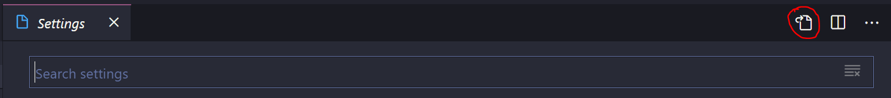

# django-keycloak-rest
Implementação de middlewear utilizando keycloack aplicação rest  
Desenvolvimento de um middleware de authenticação Oauth2  
Capaz validar uma requisição rest atravez do django

## Pré requisitos para utilização desse projeto

para o uso é necessário:  
- [x] pré requisitos
    - [x] docker - Docker version 20.10.8, build 3967b7d
    - [x] docker-compose - Docker Compose version v2.2.2
    - [x] visual studio
    - [x] extensions: Remote - Containers
    - [x] [documentação](https://code.visualstudio.com/docs/remote/containers)

 - django 
 - djangorestframework
 
## Servidor de Authenticação Keycloak
Serviço de authenticação para aplicaçõe em ambiente de teste temos um servidor  
instalado com o devcontainer e um postgres para gerenciar o serviço

 - Container de instalado um keycloak server para os testes
 - Postgres que acompanha o servidor de autenticação

usuario criado na instalação do dev container keycloak
- admin
- Pa55w0rd 

## Configurações do projeto

 - Definido um API restfull (modelagem , relacionamentos)
 - Testes 

 libs instaladas:
    - django
    - djangorestframework
    - pylint-django
    
    - requests
    - jsonpath **navegar dentro json**
    - pytest

## Servidor de Email Test mailhog
Servidor de teste de emails
- host: mailhog
- port: 1025 smtp
- 8025: pagina web


## Configuração Basica Keycloak standalone
Agora vamos para instalação é preciso configuração minima para o bom funcionamento do keycloak.  
- localhost:8080
- admin
- Pa55w0rd 
- criar um novo helm  / public / oauth2
- definir rota http://localhost:8080/* de redirects e web origin
- standalone
- direct access grants enable


## Configurações a parte.
algumas dicas de configurações interresantes para facilitar o uso

- Criando super user no django sem shell interativo via cli.
```bash
# Execute esses comandos em projeto django criado!
# Verifica se há altereções nas models do projeto
python manage.py makemigrations
# Aplica as migrações 
python manage.py migrate
# Cria super usuario django 
echo "from django.contrib.auth.models import User; User.objects.create_superuser('admin', 'admin@example.com', 'admin')" | python ./manage.py shell
```
Dependencias de desenvolvimento  
```bash
# essa biblioteca de lint vai resolver as dependencias dentro do vscode (desenvolvimento)
pip install pylint-django
```
Depois de instalar essa dependencia de desenvolvimento, vá no vscode e inclua essa configuração no settings
arquivo > preferencias > configurações
Icone no canto superior direito edit o arquivo 

```json
"python.linting.pylintArgs": [
        "--load-plugins=pylint_django"
],
```
reinicie o vscode !

# Bibliografia

- https://docs.djangoproject.com/en/4.0/
- https://www.django-rest-framework.org/
- https://www.keycloak.org/documentation
- https://cursos.alura.com.br/forum/topico-class-aluno-has-no-objects-member-126928

